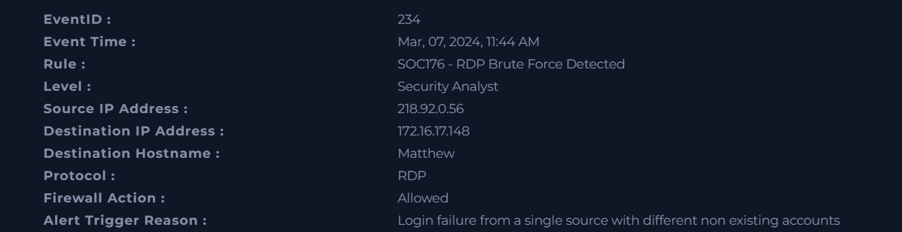
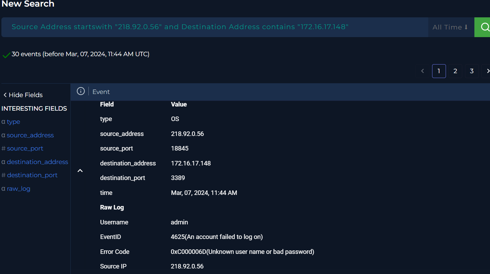
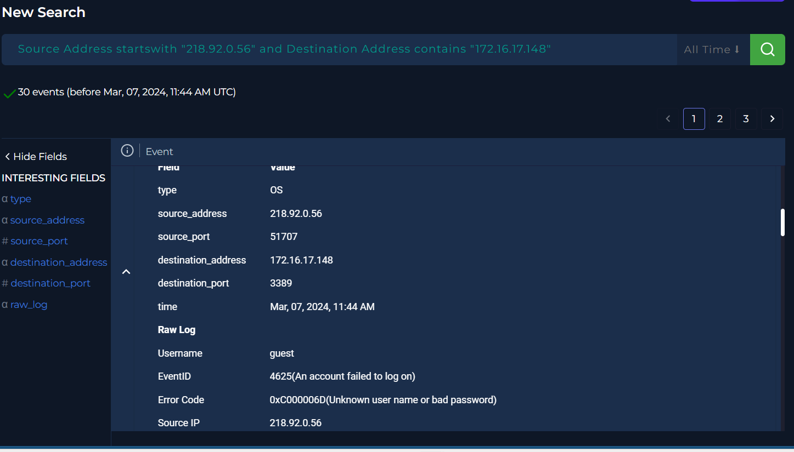
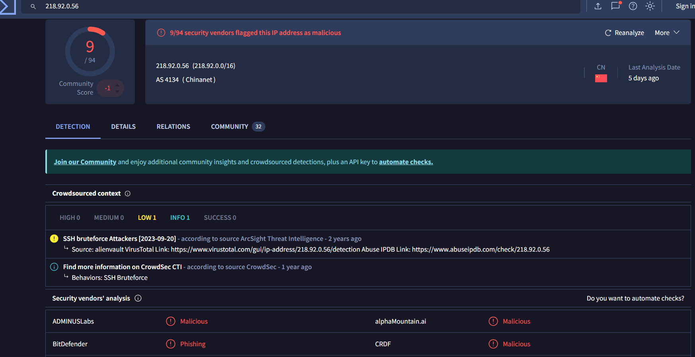

# SOC Brute Force Investigation – RDP Attack

## 🧪 Environment
- Platform: LetsDefend SOC simulation lab  
- Attack Type: Brute Force / Credential Guessing  
- Target Service: Remote Desktop Protocol (RDP)  
- Severity: Medium–High  

---

## 🧾 Incident Summary
A brute force attack targeting an RDP service was detected during analysis.  
Multiple failed login attempts were observed from a single external IP address attempting to access an internal system.

The activity is consistent with automated credential guessing techniques.

No successful authentication was observed, and the incident was classified as a **true positive**.

---

## 🖥️ Incident Details

- Event ID: 234  
- Detection Rule: SOC176 – RDP Brute Force Detected  
- Source IP: 218.92.0.56  
- Destination IP: 172.16.17.148  
- Protocol: RDP  
- Target Host: Matthew  
- Firewall Action: Allowed  

---

## 🔍 Log Analysis

Analysis of authentication logs revealed:

- Multiple failed login attempts from a single source IP  
- Attempts used different non-existent usernames  
- Repeated authentication failures within a short time period  
- No successful login events detected  

This pattern strongly indicates an automated brute force attempt.

---

## 🧠 Threat Analysis

The attack targeted an exposed RDP service and demonstrated:

- Credential guessing behavior  
- Repeated authentication attempts  
- Possible password spraying technique  
- Reconnaissance for valid user accounts  

This type of activity is commonly used as an initial access technique.

---

## 🌐 Threat Intelligence

The source IP (218.92.0.56) was analyzed using threat intelligence tools such as VirusTotal.

Findings:
- Multiple detections indicating suspicious activity  
- IP not associated with legitimate services  
- Known patterns consistent with brute force attacks  

These findings support classification as a malicious source.

---

## 🚩 Indicators of Compromise (IOCs)

### Network Indicators
- Source IP: 218.92.0.56  
- Destination IP: 172.16.17.148  

### Behavioral Indicators
- Multiple failed login attempts  
- Repeated authentication requests  
- Suspicious login patterns  

---

## 📊 Impact Assessment

- No confirmed unauthorized access  
- No successful authentication detected  
- However, brute force attacks pose significant risk if successful  

Potential impact includes:
- Unauthorized system access  
- Credential compromise  
- Lateral movement within the network  

---

## 🛡️ Recommendations

- Implement account lockout policies  
- Restrict RDP access (VPN or IP allowlisting)  
- Enable Multi-Factor Authentication (MFA)  
- Monitor repeated login failures  
- Block or blacklist suspicious IP addresses  
- Enforce strong password policies  

---

## 📌 Conclusion

This investigation confirmed a brute force attack targeting an RDP service.

The activity aligns with known credential guessing techniques and was correctly identified by SOC detection rules.

Although no successful compromise occurred, the incident highlights the importance of securing remote access services and monitoring authentication activity.
