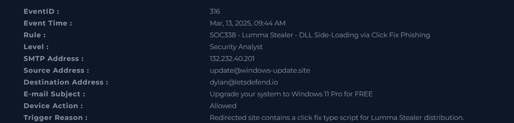
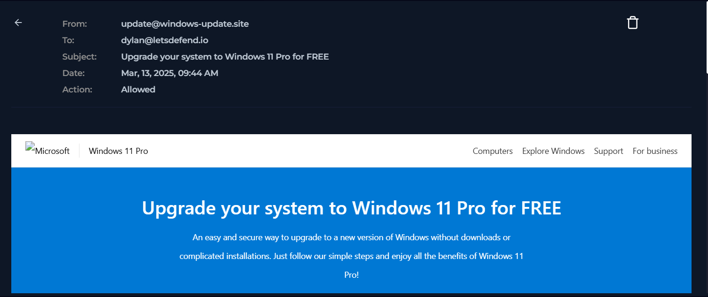
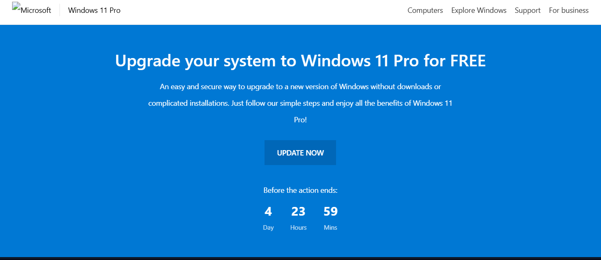
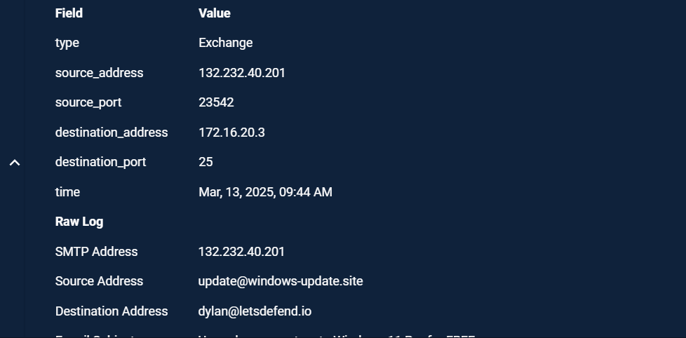
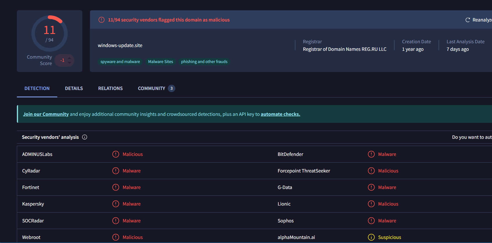
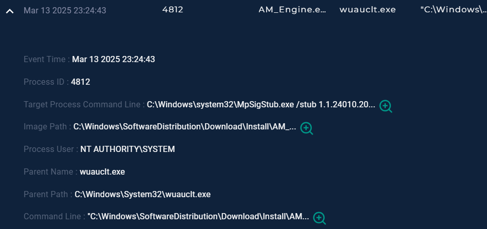
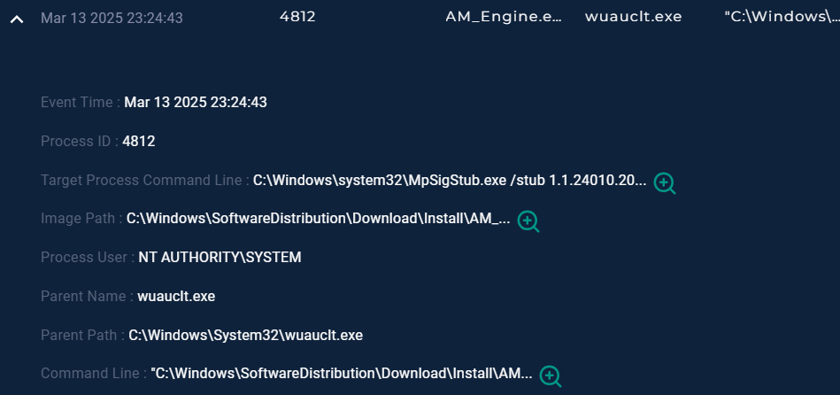

.

🛡️ SOC Malware Investigation Report
Lumma Stealer – ClickFix Phishing Campaign (DLL Side-Loading)
_______________________________________________________________________________________________________________________

📌 1. Executive Summary

A phishing campaign was identified delivering a fake Windows Update link (windows-update.site).
User interaction led to a malicious landing page associated with Lumma Stealer activity.

The attack demonstrates a multi-stage infection chain involving phishing, social engineering, and potential DLL side-loading behavior.

Final Classification: 🔴 True Positive (Critical)
___________________________________________________________________________________________________________________________________________________
🧪 2. Environment
Platform: LetsDefend SOC Lab
Case ID: SOC338
Attack Type: Phishing / Malware Delivery
Threat: Info-Stealer (Lumma Stealer)
Severity: Critical

 

📧 3. Initial Access (Email Analysis)

A phishing email was delivered to the user containing a malicious link impersonating Windows Update.

Key Observations:
External sender domain
Fake Windows update theme
Delivered successfully
Contains malicious URL

_____________________________________________________________________________________-
🌐 4. Web / Domain Analysis

The user was redirected to a fake update domain.

Indicators:
Domain impersonates Microsoft services
Newly registered / suspicious domain
Marked malicious by threat intel tools

______________________________________________________________________________________________________
🧠 5. Threat Intelligence Analysis

Hybrid analysis confirmed malicious behavior linked to phishing infrastructure.

Findings:
Trojan_HTML_FakeCaptcha detection
Low AV detection but high confidence malicious
Associated with Lumma Stealer campaigns

Malicious HTML page identified as fake Windows update portal
Classified as Trojan_HTML_FakeCaptcha by multiple engines
Confirms phishing infrastructure used in initial access stage

____________________________________________________________________________________________________________
💻 6. Endpoint Behavior Analysis

Suspicious system activity observed after interaction.

Key Indicators:
Execution under Windows system directories
Process chain resembles Windows Update activity
Possible DLL side-loading behavior
SYSTEM-level execution context

Suspicious executable launched via Windows update service chain
File executed from SoftwareDistribution download directory
Indicates potential malicious payload execution path
_______________________________________________________________________________________________________
🚩 7. Indicators of Compromise (IOCs)
🌐 Network
Domain: windows-update.site
Phishing URL used for redirection
📁 File
MD5: b4d09773c732ae0da41449cb6d0ac0fa9903c0e4b7ea2efdf06321f2a569e2db

_____________________________________________

🧠 8. MITRE ATT&CK Mapping
T1566.002 – Phishing (Link-based)
T1204.001 – User Execution (Clicking link)
T1189 – Drive-by Compromise
T1036 – Masquerading (Windows Update impersonation)
T1059 – Command Execution
T1105 – Remote File Transfer (possible payload stage)

____________________________________________________________________
📊 9. Impact Assessment
Credential theft risk
Browser data compromise
Potential Lumma Stealer infection
Data exfiltration risk
Multi-stage infection chain

____________________________________________________________________________
🛡️ 10. Recommendations
Email Security
Block malicious sender/domain
Enable DMARC, SPF, DKIM enforcement
Improve phishing URL filtering
Web Security
Block domain at DNS + proxy level
Monitor newly registered domains
Use URL sandboxing
Endpoint Security
Monitor Windows system directory execution
Detect DLL side-loading behavior
Enable EDR behavioral alerts
User Awareness
Train users on fake update scams
Encourage phishing reporting
Avoid clicking unsolicited links

____________________________________________________________________________
📌 11. Conclusion

The investigation confirmed a phishing campaign targeting users through a fake Windows Update site.

The attack chain demonstrates:

Social engineering entry point
Malicious web redirection
Possible DLL side-loading execution
High-risk info-stealer activity (Lumma Stealer)

Final Result: Critical True Positive – Incident contained and documented.
