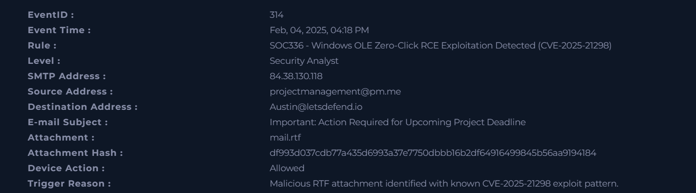
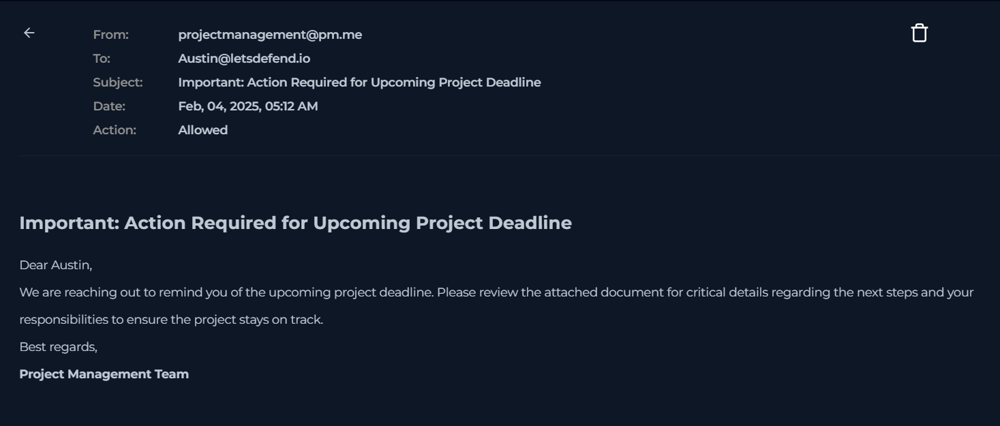
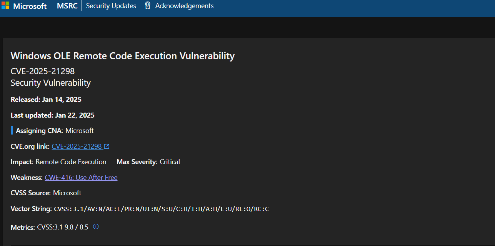
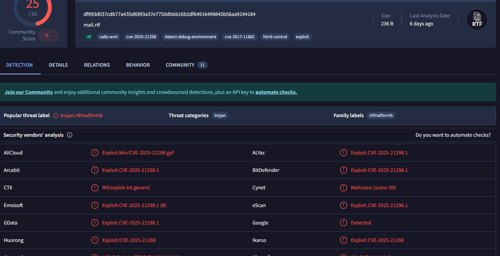

# SOC Malware Investigation – Email-Based Exploit (CVE-2025-21298)

## 🧪 Environment
- Platform: LetsDefend SOC simulation lab  
- Attack Type: Phishing with malicious attachment  
- Threat Category: Malware Delivery / Remote Code Execution  
- Severity: High  

---

## 🧾 Incident Summary
A phishing email containing a malicious RTF attachment was identified during analysis.  
The alert was triggered by detection rules matching exploit patterns associated with **CVE-2025-21298**, a Windows OLE Remote Code Execution vulnerability.

The attack leveraged social engineering techniques to prompt user interaction and potentially execute malicious code.

This incident was classified as a **high-confidence true positive**.

---

## 🖥️ Incident Details

- Event ID: 314  
- Detection Rule: SOC336 – Windows OLE Zero-Click RCE Exploitation Detected  
- Source Email: projectmanagement@pm.me  
- Destination Email: Austin@letsdefend.io  
- Attachment: mail.rtf  
- File Hash: df993d037cdb77a435d6993a37e7750dbbb16b2df64916499845b56aa9194184  
- Timestamp: Feb 04, 2025  

---

## 🌐 Alert Overview
The SOC detection system identified a suspicious email containing an attachment flagged for exploit behavior.

Key observations:
- Email originated from an external SMTP domain  
- Attachment matched known exploit patterns  
- Subject line designed to create urgency  
- Email allowed but flagged for investigation  

---

## 📧 Email Analysis

The phishing email demonstrated clear social engineering characteristics:

- Sender domain: pm.me (external provider)  
- Subject: “Important: Action Required for Upcoming Project Deadline”  
- Message designed to pressure the recipient into action  
- No legitimate business context identified  

These indicators strongly suggest a phishing attempt.

---

## 🧠 Attachment & Exploit Analysis

- File type: RTF document (mail.rtf)  
- RTF files are commonly used in exploit-based attacks  
- Associated with **CVE-2025-21298** (Windows OLE RCE vulnerability)  
- Exploit likely embedded within document structure  

This vulnerability allows attackers to execute code through specially crafted files.

---

## 🚩 Indicators of Compromise (IOCs)

### Email Indicators
- Sender: projectmanagement@pm.me  
- Recipient: Austin@letsdefend.io  
- Subject: Important: Action Required for Upcoming Project Deadline  

### File Indicators
- Attachment: mail.rtf  
- Hash: df993d037cdb77a435d6993a37e7750dbbb16b2df64916499845b56aa9194184  

---

## 📊 Impact Assessment
- No confirmed execution observed  
- No evidence of system compromise  
- High risk if attachment is opened  

Potential impact:
- Remote code execution  
- System compromise  
- Malware installation  

---

## 🛡️ Recommendations

- Block sender email/domain  
- Quarantine suspicious attachments  
- Analyze file hash using threat intelligence tools  
- Ensure systems are patched against CVE-2025-21298  
- Enable advanced email filtering and endpoint protection  
- Conduct user phishing awareness training  

---

## 📌 Conclusion
This investigation identified a phishing-based malware delivery attempt using a malicious RTF attachment.

The activity aligns with known exploitation techniques targeting Windows OLE vulnerabilities.

The incident was correctly classified as a **true positive**, demonstrating effective detection and SOC analysis workflow including:
- Alert triage  
- Email analysis  
- Malware identification  
- IOC extraction  
- Incident reporting  
