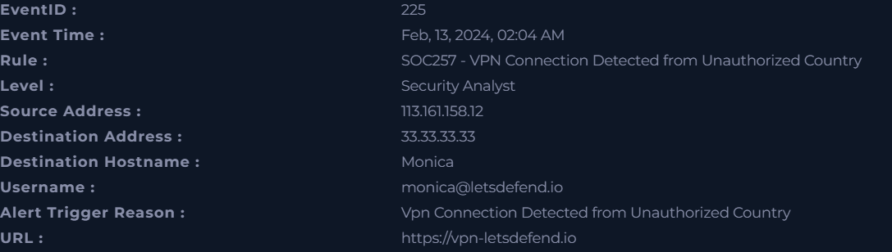

# Unauthorized Access Investigation – VPN Anomaly

## 🧩 Incident Summary
A VPN login was detected from an unauthorized country involving user **monica@letsdefend.io**. The activity originated from a suspicious external IP address and occurred at an unusual time.

---

## 📌 Incident Details
- Event ID: 225  
- Rule: SOC257 – VPN Connection from Unauthorized Country  
- Username: monica@letsdefend.io  
- Source IP: 113.161.158.12  
- Destination Host: Monica  
- Time: Feb 13, 2024 – 02:04 AM  

---

## 🔍 Log Analysis
- VPN connection observed from external IP 113.161.158.12  
- Traffic directed to vpn-letsdefend.io over port 443  
- Access targeted internal system 33.33.33.33  
- Login occurred at unusual time (02:03–02:04 AM)  
- Behavior indicates suspicious remote access attempt  

---

## 🧪 Threat Intelligence
- Source IP analyzed using VirusTotal  
- Reputation checked for malicious activity  
- Results may vary across threat intelligence sources  
- Geographic anomaly is a key indicator of risk  

---

## 🚩 Indicators of Compromise (IOCs)
**Network IOCs**
- Source IP: 113.161.158.12  
- Destination IP: 33.33.33.33  

**Account IOCs**
- monica@letsdefend.io  

**Behavioral IOCs**
- VPN login from unauthorized country  
- Unusual login time  
- External remote access attempt  

---

## 📊 Findings
- Login originated from an untrusted location  
- Activity does not match normal user behavior  
- No confirmation of legitimate user activity  
- Strong indication of unauthorized access attempt  

---

## 🎯 Conclusion
This incident is classified as a **True Positive**. The account is potentially compromised and shows signs of unauthorized VPN access.

---

## 🛠️ Recommendations
- Reset user credentials immediately  
- Enable Multi-Factor Authentication (MFA)  
- Block or monitor source IP  
- Review account activity for further compromise  
- Restrict VPN access by geographic rules  
