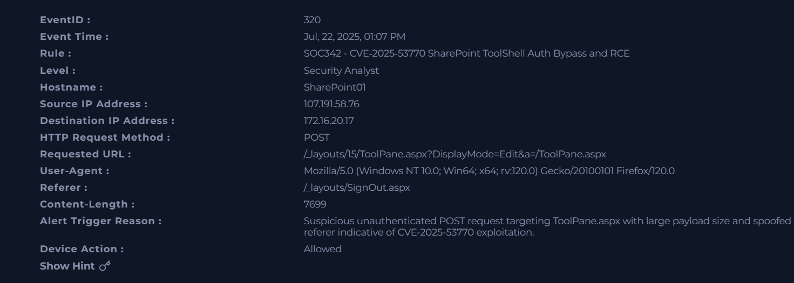
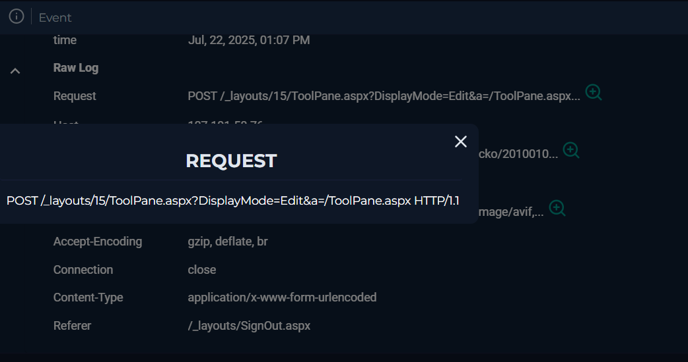
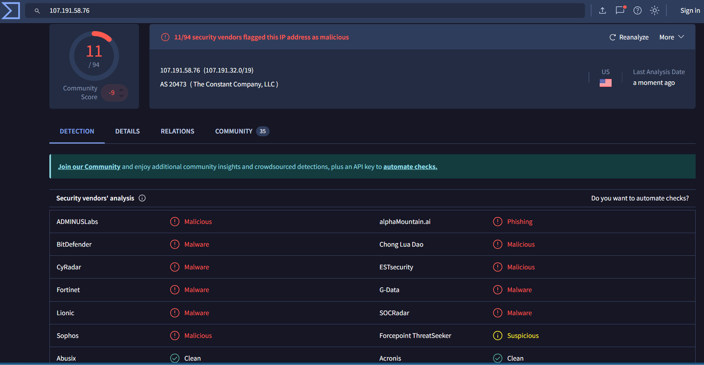

# SOC Web Attack Investigation – SharePoint Exploitation Attempt

## 🧪 Environment
- Platform: LetsDefend SOC simulation lab  
- Attack Type: Web Attack / Exploitation Attempt  
- Target: SharePoint Server (SharePoint01)  
- Severity: High (Simulated Incident)

---

## 🧾 Incident Summary
A suspected web attack was detected targeting a SharePoint server.  
The activity is associated with exploitation attempts against **CVE-2025-53770 (SharePoint ToolShell vulnerability)**.

The request appeared to be an unauthenticated attempt to access a sensitive endpoint with suspicious payload characteristics.

No confirmed system compromise was observed in available logs.

---

## 🖥️ Incident Details

- Event ID: 320  
- Detection Rule: SOC342 – CVE-2025-53770 SharePoint ToolShell Exploit  
- Source IP: 107.191.58.76  
- Destination IP: 172.16.20.17  
- Target Endpoint: /layouts/15/ToolPane.aspx  
- HTTP Method: POST  
- Timestamp: Jul 22, 2025  

---

## 🌐 Alert Overview
The SOC detection rule flagged an unauthenticated POST request targeting a SharePoint administrative endpoint.

The request contained multiple suspicious indicators:

- Large payload size  
- Suspicious HTTP headers  
- Spoofed referrer (`/layouts/SignOut.aspx`)  
- Legitimate-looking User-Agent (Firefox)  

These behaviors are commonly associated with automated exploitation attempts.

---

## 🔍 Attack Analysis

The request was analyzed in detail and showed the following:

- Targeted endpoint: `/layouts/15/ToolPane.aspx`  
- Attempted access without authentication  
- Payload size approximately 7699 bytes  
- HTTP POST method used for potential exploit delivery  
- Possible attempt to trigger remote code execution behavior  

Overall activity is consistent with known web exploitation patterns.

---

## 🧠 Threat Intelligence / IOCs

### Network Indicators
- Source IP: 107.191.58.76  
- Destination IP: 172.16.20.17  

### Web Indicators
- Target Endpoint: /layouts/15/ToolPane.aspx  
- HTTP Method: POST  
- Referer: /layouts/SignOut.aspx  
- Payload Size: 7699 bytes  

This activity aligns with known exploit behavior targeting SharePoint vulnerabilities.

---

## 📊 Impact Assessment
- No confirmed compromise detected  
- No evidence of data exfiltration  
- No post-exploitation activity observed  
- Activity was detected and logged by SOC rules  

However, if successful, this type of attack could result in:
- Remote code execution  
- System compromise  
- Unauthorized access to internal systems  

---

## 🛡️ Recommendations

- Block suspicious source IP addresses  
- Apply latest SharePoint security patches  
- Enable Web Application Firewall (WAF) rules  
- Monitor for repeated exploitation attempts  
- Strengthen logging and alerting on web endpoints  

---

## 📌 Conclusion
This investigation identified a simulated web exploitation attempt targeting a SharePoint server.

The activity shows strong indicators of vulnerability probing consistent with CVE-2025-53770 exploitation attempts.

The case demonstrates SOC analyst workflow including:
- Alert triage  
- Log analysis  
- Threat validation  
- IOC extraction  
- Incident reporting  
